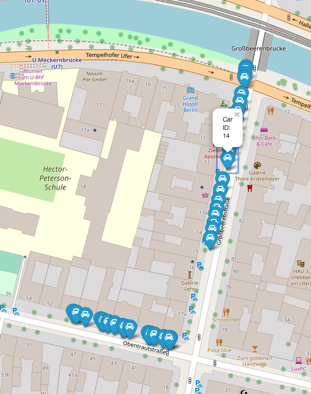

# YOLOv5-Tracker


This repository contains extra methods on top of the [ultralytics yolov5 repository](https://github.com/ultralytics/yolov5)
Extra features are:
- Light, strong custom object tracker
- Key point finder and feature matcher with optical flow
- Variance of the image laplacian to calculate image blur(To avoid possible false detections)

## Statistical Accuracy

### Object Detection Accuracy
** 
### Tracker Algorithm Accuracy
```bash
Whole pipeline is runned on 100 randomly selected videos from Berlin. 
Within each video, a json file that indicates the individual car locations is also available. (private data)
Model output is compared with ground truth data.
Tracker algorithm success calculated as 89.5% in the test. 
```


Due to some privacy reason, the geo location of the videos are not to be shared. But an example output of map module(not included in the repository) is represented here:



## Requirements

To install the pipeline run:
```bash
$ pip install -r requirements.txt
```

## Inference
To run the inference on test video simply run:
```bash
$ python analysis/main.py
```
To run the inference on a defined video simply run:
```bash
$ python analysis/main.py --source /path/to/video.mp4
```

In default script saves the video output, if you do not want to save them, simply assign video_output argument to False by:
```bash
$ python analysis/main.py --source /path/to/video.mp4 --video_output False
```

If you want a faster inference time, you can reduce the image size by:

```bash
$ python analysis/main.py --source /path/to/video.mp4 --img_size 320
```
or
```bash
python analysis/main.py --source /path/to/video.mp4 --img_size 160
```

## Update on 28th January

#### Car Plate Number Detection & Anonymisation script is added. 

If you want to anonymise car plates, please first download the trained model.
Models have trained with Nvidia-Tesla V100 GPU over 100 epochs on the private european car plate dataset. 

| Model | size | AP<sub>50</sub> | 
|---------- |------ |------ |
| [YOLOv5s](https://drive.google.com/drive/folders/1DzhKjlnYQsNT6-UhkhDExFG6ZS1UQHCc)    |640 | 92.3 |
| [YOLOv5x](https://drive.google.com/drive/folders/1DzhKjlnYQsNT6-UhkhDExFG6ZS1UQHCc)    |640 | 97.5 |


- Yolov5s in real-time:

